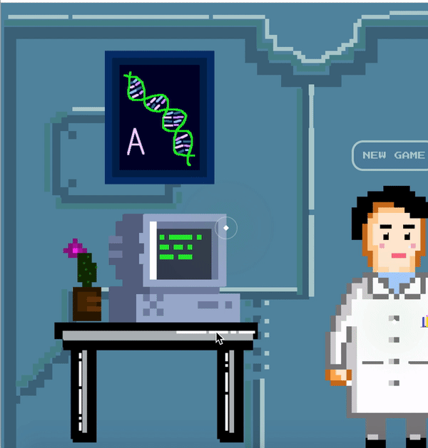
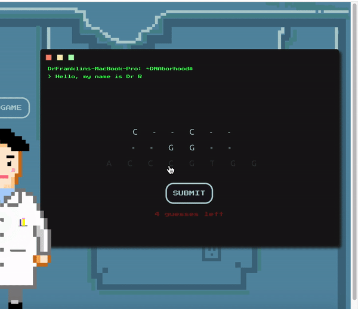

# DNAborhood Read.ME
Navigate around Dr. Rosalind Franklin's lab and help her sequence some genomes!
[Live Game](https://v-campbell.github.io/DNAborhood/)
***

## Live
Play the game live [here!](https://v-campbell.github.io/DNAborhood/)

## Description
Welcome to the DNAborhood - learn about genome sequencing through a fun, exciting, and extremely well-executed game and various interactive elements.

## Overview
* New game will randomly generate two strings, randomly hide characters in those strings and start you off with 4 guesses
* Sounds hard? Fear not. The top string and bottom string are connected, just like real DNA
* Win by filling in the spaces with available letters from the pool and guessing the correct sequence
* Hover over the glowing green orbs on the page to learn more about the wonderful world of DNA!

## Functionality

* Start and restart game
* Show losing or winning message
* Allow users to interact with elements on the page

## Languages and Technologies

* Vanilla JavaScript
* HTML5/ CSS3

## Additional features

* Image 1 - Interactive "orb" elements with animated pop-up

```
@keyframes pulse {
	0% {
		/* transform: scale(0.95); */
	}

	50% {
        /* transform: scale(1); */
        color: rgba(132, 168, 247, 0.459)	}

	100% {
		/* transform: scale(0.95); */
	}
}
```



* Image 2 - Click to place letters or swap letters using a click counter 

```
this.hiddenTopStrand.map((letter, i) => {
      let div = document.createElement("div");
      if (letter.length > 1) div.innerHTML = letter.charAt(0);
      if (letter.length === 1) div.innerHTML = letter;
      div.className = "letters";
      div.id = "topletter" + i;

      div.addEventListener("click", () => {
        if (clicks === 0) {
          div.className += " selected";
          clicks += 1;
        } else {
          let selected = document.getElementsByClassName("selected").item(0);
          selected.className = selected.className.replace(" selected", "")

          let temp = div.innerHTML;
          div.innerHTML = selected.innerHTML;
          selected.innerHTML = temp;

          clicks = 0;
          topGuess[i] = div.innerHTML;
        }
      })
      top.appendChild(div);
    })
```



## Future considerations

* Leaderboard
* Counter for strands sequenced
* Cycle through facts with each hover
* More hoverable, informational green orbs!

